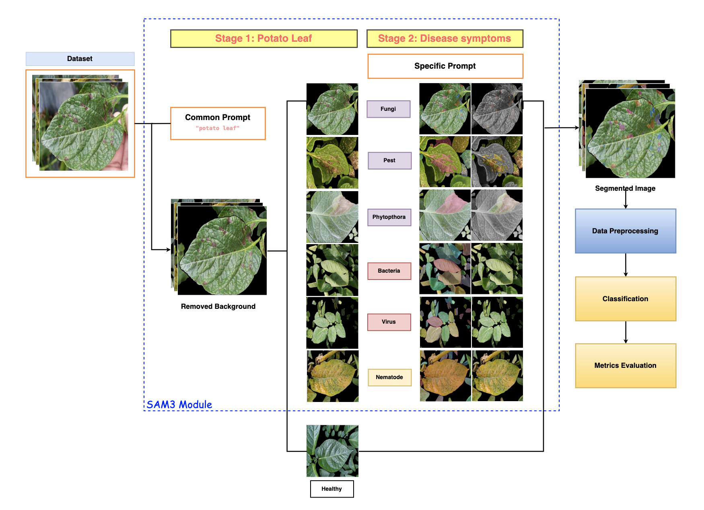

# Lesion-Aware Potato Disease Classification (SAM3 + EfficientViT)

This project introduces a **Lesion-Aware Data Preprocessing** stage to the potato disease detection pipeline. By integrating the **Segment Anything Model 3 (SAM3)**, we preprocess raw potato leaf images to remove backgrounds and focus on specific disease symptoms (lesions) before feeding them into the classification model (EfficientNetV2B3+ViT).

This work improves upon the baseline architecture described in **[BASELINE.md](BASELINE.md)**.

## 🏗️ Architecture & Workflow




The enhanced pipeline consists of two main stages:
1.  **Lesion-Aware Preprocessing (SAM3)**: Raw images are processed using SAM3 with class-specific text prompts to isolate the leaf and disease lesions.
2.  **Classification (EfficientViT)**: The "focused" images are used to train/test the hybrid EfficientNetV2B3+ViT model.

### Key Components
- **`src/lesion_aware.py`**: The main script for the preprocessing workflow. It iterates through the dataset and applies SAM3 segmentation.
- **`src/custom_sam3.py`**: A wrapper class for the SAM3 model, handling image loading, prompt processing, and mask application.

## 🚀 Usage

### 1. Setup Environment
Ensure you have the necessary dependencies installed (including `sam3` and its requirements).

### 2. Prepare Raw Data
Organize your raw dataset in `data/potatodata` (or similar) with subdirectories for each class.

### 3. Run Lesion-Aware Preprocessing
Run the `lesion_aware.py` script to generate the processed dataset.

```bash
python src/lesion_aware.py --source ../data/potatodata --target ../data/potatodata_lesion_aware --device cuda
```

**What happens here?**
The script uses visual characteristic prompts (derived from our research report) to guide SAM3.

This ensures the background is removed and the model focuses on the relevant symptoms.

### 4. Train the Model
Once the new dataset is generated, update your configuration to point to it.

1.  Open `src/configurations.py`.
2.  Update the `DATA` variable:
    ```python
    DATA = "../data/potatodata_lesion_aware"
    ```
3.  Run the training baseline as described in **[BASELINE.md](BASELINE.md)**:
    ```bash
    python src/train.py
    ```

## 📊 Visual Prompts (Table 4)
The logic for symptom-based segmentation is defined in `src/lesion_aware.py`. Below is a summary of the visual characteristics used as prompts:

| Class | Visual Characteristics / SAM3 Prompts |
| :--- | :--- |
| **Virus** | crinkled leaf surface, mosaic pattern, curled leaf, mottled leaf, necrotic spot |
| **Phytophthora** | dark brown lesion, black lesion, circular necrotic patch, irregular dark spot |
| **Nematode** | yellowish leaf patch, yellowing leaf, discolored leaf area |
| **Fungi** | circular spot, concentric ring spot, sunken spot with yellow border |
| **Bacteria** | wilted leaf, drooping leaf, shriveled leaf, soft rot spot |
| **Pest** | distilled leaf tissue, leaf hole, mined leaf route, silver dots |
| **Healthy** | uniform green potato leaf |

## 📈 Experimental Results

Below is a summary of the model performance comparing our proposed **SAM3 + EfficientViT** pipeline against the baseline.

### Table 4.2: Overall Performance Comparison
| Model / Method | Acc (%) | Pre (%) | Rec (%) | F1 (%) | MCC |
| :--- | :---: | :---: | :---: | :---: | :---: |
| **EfficientViT (Baseline)\*** | 85.06 | 82.86 | 85.29 | 83.77 | 0.8200 |
| **EfficientViT (Re-impl)** | 85.06 | 82.37 | 85.53 | 83.52 | 0.8200 |
| **Proposed (Lesion-Aware)** | **86.36** | **83.30** | 81.87 | 82.53 | **0.8303** |

### Table 4.3: Performance Improvement by Class (Proposed vs Baseline)
| Class | Acc (Δ) | Pre (Δ) | Rec (Δ) | F1 (Δ) | MCC (Δ) |
| :--- | :---: | :---: | :---: | :---: | :---: |
| **Phytophthora** | +0.0435 | +0.2324 | +0.0435 | +0.1488 | +0.1564 |
| **Fungi** | +0.0650 | +0.0239 | +0.0650 | +0.0447 | +0.0568 |
| **Pest** | +0.0492 | -0.0181 | +0.0492 | +0.0164 | +0.0173 |
| **Bacteria** | +0.0263 | +0.0016 | +0.0263 | +0.0136 | +0.0182 |
| **Healthy** | 0.0000 | 0.0000 | 0.0000 | 0.0000 | 0.0000 |
| **Virus** | -0.1064 | -0.0498 | -0.1064 | -0.0791 | -0.0917 |
| **Nematode** | -0.3333 | -0.1250 | -0.3333 | -0.2143 | -0.2254 |

*Note: Positive values (Δ > 0) indicate improvement over the baseline.*

## 📄 Reference
For details on the baseline EfficientViT model, training parameters, and logging, please refer to **[BASELINE.md](BASELINE.md)**. Reference github: **[potato-efficientViT](https://github.com/HJacksons/potato-efficientViT/tree/main)**

